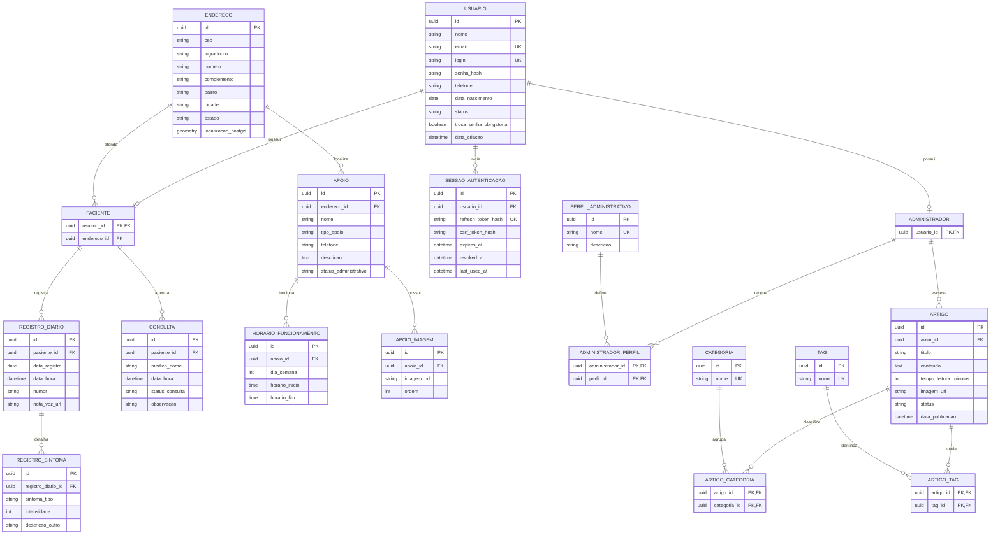

```mermaid
erDiagram
    USUARIO ||--o| PACIENTE : possui
    USUARIO ||--o| ADMINISTRADOR : possui
    USUARIO ||--o{ SESSAO_AUTENTICACAO : inicia
    ENDERECO ||--o{ PACIENTE : atende
    PACIENTE ||--o{ REGISTRO_DIARIO : registra
    REGISTRO_DIARIO ||--o{ REGISTRO_SINTOMA : detalha
    PACIENTE ||--o{ CONSULTA : agenda

    ENDERECO ||--o{ APOIO : localiza
    APOIO ||--o{ HORARIO_FUNCIONAMENTO : funciona
    APOIO ||--o{ APOIO_IMAGEM : possui

    ADMINISTRADOR ||--o{ ADMINISTRADOR_PERFIL : recebe
    PERFIL_ADMINISTRATIVO ||--o{ ADMINISTRADOR_PERFIL : define

    ADMINISTRADOR ||--o{ ARTIGO : escreve
    ARTIGO ||--o{ ARTIGO_CATEGORIA : classifica
    CATEGORIA ||--o{ ARTIGO_CATEGORIA : agrupa
    ARTIGO ||--o{ ARTIGO_TAG : rotula
    TAG ||--o{ ARTIGO_TAG : identifica

    USUARIO {
        uuid id PK
        string nome
        string email UK
        string login UK
        string senha_hash
        string telefone
        date data_nascimento
        string status
        boolean troca_senha_obrigatoria
        datetime data_criacao
    }

    SESSAO_AUTENTICACAO {
        uuid id PK
        uuid usuario_id FK
        string refresh_token_hash UK
        string csrf_token_hash
        datetime expires_at
        datetime revoked_at
        datetime last_used_at
    }

    PACIENTE {
        uuid usuario_id PK, FK
        uuid endereco_id FK
    }

    ADMINISTRADOR {
        uuid usuario_id PK, FK
    }

    PERFIL_ADMINISTRATIVO {
        uuid id PK
        string nome UK
        string descricao
    }

    ADMINISTRADOR_PERFIL {
        uuid administrador_id PK, FK
        uuid perfil_id PK, FK
    }

    ENDERECO {
        uuid id PK
        string cep
        string logradouro
        string numero
        string complemento
        string bairro
        string cidade
        string estado
        geometry localizacao_postgis
    }

    REGISTRO_DIARIO {
        uuid id PK
        uuid paciente_id FK
        date data_registro
        datetime data_hora
        string humor
        string nota_voz_url
    }

    REGISTRO_SINTOMA {
        uuid id PK
        uuid registro_diario_id FK
        string sintoma_tipo
        int intensidade
        string descricao_outro
    }

    CONSULTA {
        uuid id PK
        uuid paciente_id FK
        string medico_nome
        datetime data_hora
        string status_consulta
        string observacao
    }

    APOIO {
        uuid id PK
        uuid endereco_id FK
        string nome
        string tipo_apoio
        string telefone
        text descricao
        string status_administrativo
    }

    HORARIO_FUNCIONAMENTO {
        uuid id PK
        uuid apoio_id FK
        int dia_semana
        time horario_inicio
        time horario_fim
    }

    APOIO_IMAGEM {
        uuid id PK
        uuid apoio_id FK
        string imagem_url
        int ordem
    }

    ARTIGO {
        uuid id PK
        uuid autor_id FK
        string titulo
        text conteudo
        int tempo_leitura_minutos
        string imagem_url
        string status
        datetime data_publicacao
    }

    CATEGORIA {
        uuid id PK
        string nome UK
    }

    ARTIGO_CATEGORIA {
        uuid artigo_id PK, FK
        uuid categoria_id PK, FK
    }

    TAG {
        uuid id PK
        string nome UK
    }

    ARTIGO_TAG {
        uuid artigo_id PK, FK
        uuid tag_id PK, FK
    }
```