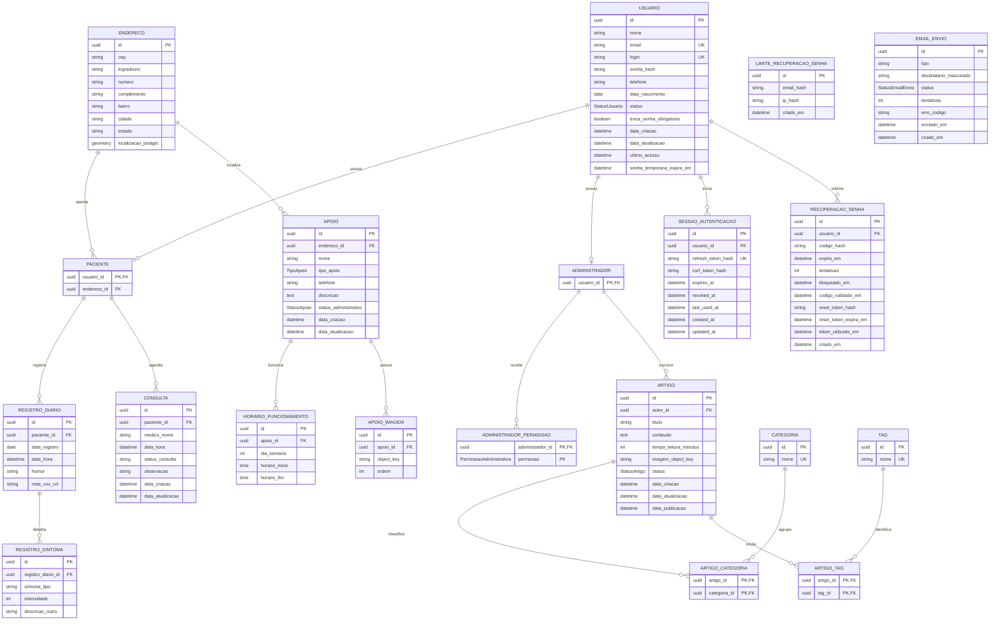

# Diagrama Entidade-Relacionamento

O diagrama abaixo representa o modelo físico definido em `src/prisma/schema.prisma`.

## Restrições e enumerações

- `registro_diario` possui unicidade composta em `(paciente_id, data_registro)`.
- `horario_funcionamento` possui unicidade composta em `(apoio_id, dia_semana, horario_inicio, horario_fim)`.
- `apoio_imagem` possui unicidade composta em `(apoio_id, ordem)`.
- `recuperacao_senha` possui índice em `(usuario_id, criado_em)`.
- `limite_recuperacao_senha` possui índices em `(email_hash, criado_em)` e `(ip_hash, criado_em)`.
- `email_envio` possui índice em `(tipo, criado_em)`.
- `artigo_categoria`, `artigo_tag` e `administrador_permissao` usam chaves primárias compostas pelas colunas indicadas no diagrama.
- Exclusões em cascata: `usuario → sessao_autenticacao`, `usuario → recuperacao_senha`, `usuario → paciente`, `usuario → administrador`, `administrador → administrador_permissao`, `paciente → registro_diario`, `registro_diario → registro_sintoma`, `apoio → horario_funcionamento`, `apoio → apoio_imagem`, `artigo → artigo_categoria/artigo_tag` e `categoria/tag →` suas respectivas tabelas associativas.

| Enum | Valores |
| --- | --- |
| `StatusUsuario` | `ATIVO`, `INATIVO`, `BLOQUEADO` |
| `StatusEmailEnvio` | `PENDENTE`, `ENVIADO`, `FALHOU` |
| `TipoApoio` | `ONG`, `CLINICA`, `TRANSPORTE`, `CASA_APOIO`, `PSICOLOGO` |
| `StatusApoio` | `RASCUNHO`, `ATIVO`, `DESATIVADO` |
| `StatusArtigo` | `RASCUNHO`, `PUBLICADO`, `DESATIVADO` |
| `PermissaoAdministrativa` | `TOTAL`, `GERENCIAR_USUARIOS`, `GESTAO_CONTEUDOS`, `GESTAO_RADAR_APOIO` |
